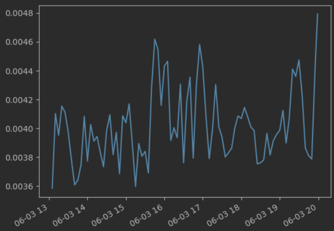

# AppLearner - Work In Progress

## Project Overview

AppLearner is a deep learning project that aims to address the challenge of accurately estimating resource requirements for workloads running on the Red Hat OpenShift Container Platform. The objective is to dynamically adjust these estimations during the course of application execution, optimizing resource utilization and avoiding under- and overutilization scenarios.

In real-life applications, manually estimating resource consumption patterns can be a difficult task, leading to suboptimal resource provisioning. While there are existing solutions that adaptively scale pods based on on-the-fly monitoring, they may prove inefficient when the application behavior is highly dynamic. AppLearner takes a proactive approach by leveraging deep learning techniques to learn and predict resource consumption patterns over time. By analyzing time-series CPU/memory usage data provided by Prometheus, AppLearner aims to generate accurate resource provisioning plans for applications.

## Example: Predicting Resource Consumption

To illustrate the goal of AppLearner, consider the example of monitoring the CPU consumption of a specific application over time. In the image below, we present a graph depicting the CPU consumption of the application over several points.

The objective of AppLearner is to accurately predict the future resource consumption of the application. By training Univariate Deep Learning time series models, we can learn patterns in CPU consumption and forecast its behavior in the next minutes, hours, and days. This predictive capability enables proactive resource provisioning and efficient management of the application's resource requirements.

Expanding on the current models, the next step in AppLearner's development is to create Multivariate Deep Learning models. These models will incorporate multiple features, such as CPU, Memory, Timestamp, and other relevant metrics, to provide more comprehensive predictions and better align resource provisioning with application demands.

## Background

### Kubernetes (Kubernetes or K8s)

Kubernetes is an open-source software platform used for managing, automating, deploying, and hosting containerized applications. It provides a framework for running and coordinating containerized workloads across a cluster of machines. Key concepts in Kubernetes include:

#### Kubernetes Cluster

A Kubernetes cluster is a collection of nodes that work together to run containerized applications. It consists of one or more master nodes responsible for managing the cluster and multiple worker nodes that execute the applications. Running a Kubernetes cluster allows you to harness the power of containerization and orchestration for efficient application deployment and scaling.

#### Kubernetes Node

Nodes are the individual machines (physical or virtual) that form part of a Kubernetes cluster. They serve as the execution environment for pods, which are the smallest deployable units in Kubernetes. Each node has all the necessary components, such as the container runtime and other essential services, to run your application containers.

#### Kubernetes Pod

A pod is a fundamental building block in the Kubernetes ecosystem. It represents a group of one or more containers that are tightly coupled and share resources within the same execution context. Pods are scheduled and run on nodes within the cluster. They provide a way to encapsulate and manage containers as a single cohesive unit, allowing applications to run efficiently and be scaled easily.

#### Kubernetes Container

In Kubernetes, a container refers to a standardized, lightweight, and isolated runtime environment for running a specific task or application. Containers package the application code along with its dependencies, libraries, and configuration, enabling consistent behavior regardless of the underlying infrastructure.

#### Kubernetes Namespace

A namespace in Kubernetes is a virtual cluster that provides a way to divide a physical cluster into multiple logical clusters. Namespaces enable different teams or projects to coexist within the same Kubernetes cluster while isolating resources and providing a level of separation. They help in organizing and managing complex deployments with multiple applications running concurrently.

### Prometheus

Prometheus is an open-source monitoring system commonly used in Kubernetes environments. It collects and stores time-series data on various aspects of the system, including pods, nodes, and other resources. Prometheus provides a rich set of metrics, such as CPU usage and memory usage, allowing users to gain insights into their applications' performance and troubleshoot issues in real time. By integrating with Prometheus, AppLearner leverages these metrics to analyze resource consumption patterns and make informed decisions for resource provisioning.

## Folders in the Repository

This repository contains the following folders:

1. **src**: This folder contains Python scripts that are used to train and run all the models. Within this folder, you will find the code responsible for data preprocessing and model training.

2. **data**: The data folder is where you should place the data required for training and testing the models. 

3. **TrainedModels**: This folder contains pre-trained model weights that can be used for inference or as a starting point for further training. These models have been trained on sample datasets and can be utilized for experimentation and testing.

4. **Notebooks**: The Notebooks folder contains Jupyter notebooks that demonstrate the usage and testing of each model. These notebooks provide a step-by-step guide on how to load data, train models, and evaluate their performance. Feel free to explore and experiment with these notebooks to gain a better understanding of the models and their capabilities.

## Work in Progress

Please note that this README file is a work in progress. The project is still under active development, and additional information, including detailed instructions, usage examples, and results, will be added in subsequent updates. Stay tuned for further updates and releases!

